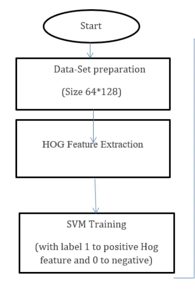
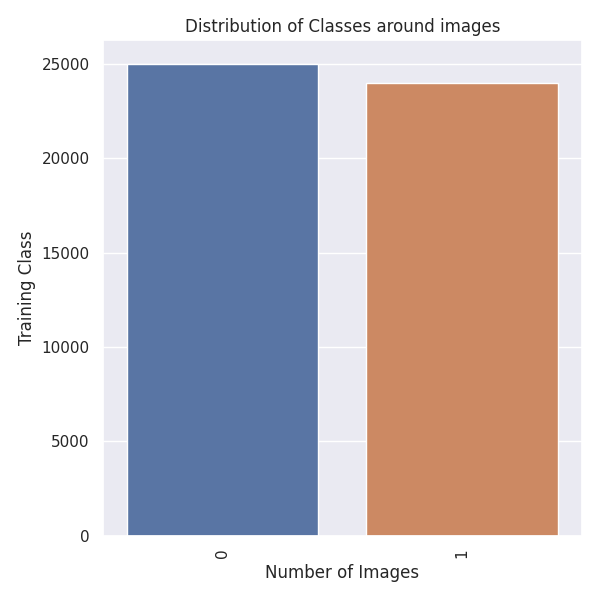
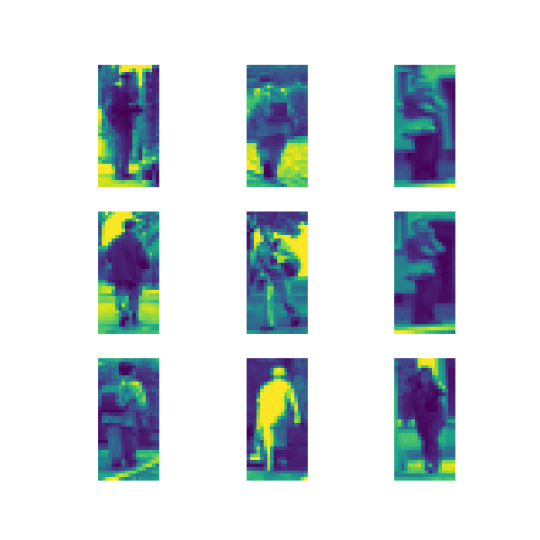
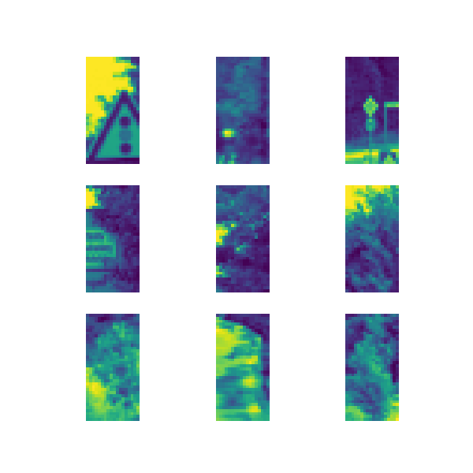
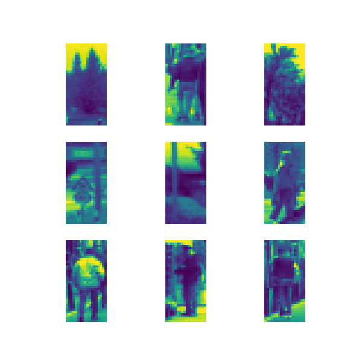
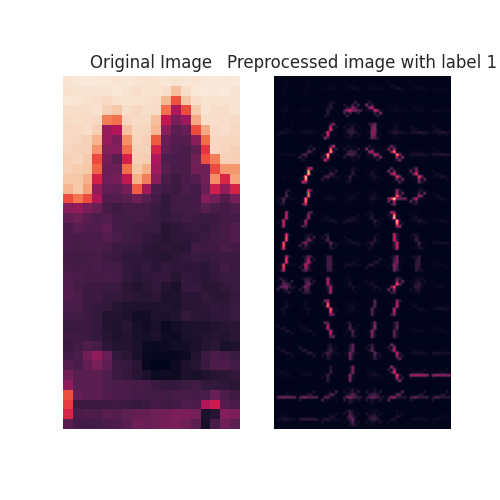
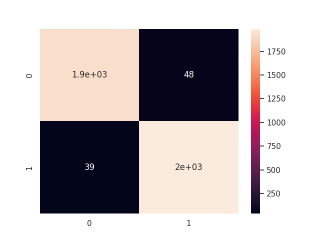
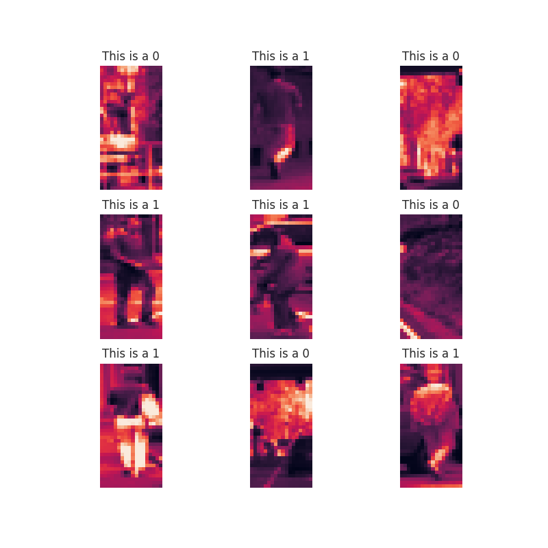

# **PedestrianGuard AI**

PedestrianGuard AI is a cutting-edge project designed to enhance urban safety by leveraging advanced image classification techniques. The primary goal of this project is to classify images swiftly and accurately, determining whether they contain pedestrians or not.

# **Key Features:**

**HOG Feature Descriptor:** PedestrianGuard AI utilizes Histogram of Oriented Gradients (HOG) as a powerful feature descriptor. HOG captures the local intensity gradients of an image, allowing for robust detection of pedestrian shapes and structures.

**SVM Classification:** The project employs Support Vector Machines (SVM) as the classification algorithm. SVM excels at distinguishing between pedestrian and non-pedestrian images, creating a reliable model for real-time decision-making.

# **How It Works:**

**Image Preprocessing:** PedestrianGuard AI preprocesses images using the HOG feature descriptor, extracting essential information about the gradients and shapes present in the image.

**Classification:** The preprocessed data is then fed into a Support Vector Machine, which has been trained on a diverse dataset to recognize patterns indicative of pedestrians. This robust classification process ensures accurate identification.

**Flow diagram of project methodology**

# **Data Set Summary & Exploration**

**1.Dataset presentation**

  - Total Number of Images =  20000
  - Number of Ped Images =  24000
  - INumber of Non Ped Images = 25000
  - Image data shape =  (36, 18)

To download the dataset use this commands

        !wget -p dataset/  http://www.lookingatpeople.com/data/Daimler/pami06-munder-gavrila/DC-ped-dataset_base.tar.gz
        !tar -xvf  /content/www.lookingatpeople.com/data/Daimler/pami06-munder-gavrila/DC-ped-dataset_base.tar.gz

**2.Visualization of the dataset.**

Here is an exploratory visualization of the data set. It is a bar chart showing how the data is ditributed across the different labels.

Here is an visualization of some 9 randomly images for each class. As we can see, within each class there is a high variability in appearance due to different weather conditions, time of the day and image angle.

**Pedestrians Images**

**Non pedestrians Images**

**Shiffled Images**

# **Images Pre-processing**

**1- Image Resizing:**

Resize images to a (64,128). This ensures that all images have the same dimensions, facilitating uniform processing and reducing computational complexity.

**2- HOG Feature Extraction:**

**Gradient Computation:** Calculate the gradient magnitude and orientation of pixel intensities in the image.

**Cell Division:** Divide the image into cells and create histograms of gradient orientations within each cell.

**Block Normalization:** Normalize the histograms within blocks to enhance the model's robustness to lighting variations.

# **Data Modeling**

**1- Features and Labels**

  - X_train shape :  (16000, 3780)
  - y_train shape :  (16000,)
  - X_test shape :  (4000, 3780)
  - y_test shape :  (4000,)

**2- Evaluate the Model**

Accuracy of Decision Tree classifer on train set: 1.00
Accuracy of Decision Tree classifer on test set: 0.98
Accuracy of the model : 0.98

**Confusion Matrix**

# **Test a Model on New Images**

